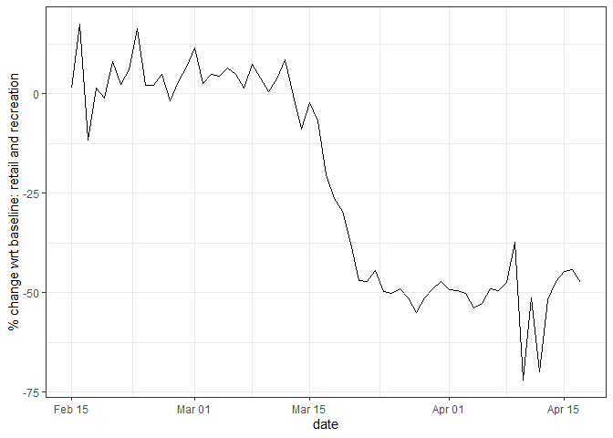
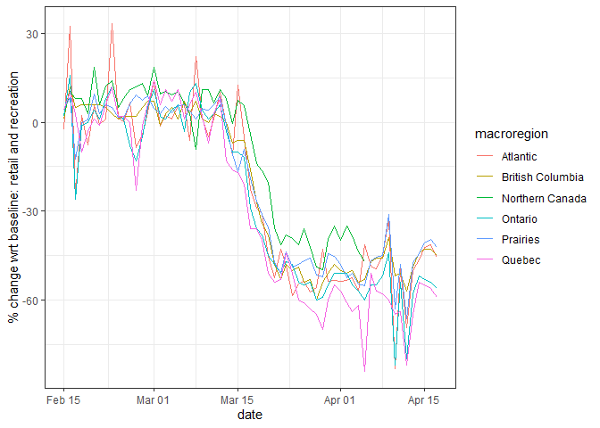

<!-- README.md is generated from README.Rmd. Please edit that file -->

# Google-COVID-19-Mobility-Reports

<!-- badges: start -->

<!-- badges: end -->

In this notebook I use `R` to retrieve Google’s [community mobility
reports](https://www.google.com/covid19/mobility/). These reports are
being released by Google to support public health experts and the public
understand the way mobility has changed with respect to a baseline level
for the duration of the COVID-19 pandemic. I was inspired to do this
after seeing Theo Lim’s GitHub
[repository](https://github.com/theochli/google_covid_mobility_map) with
Python code to download the reports and visualize the data. This is
mostly an example of how to retrieve data, and I will add analysis as I
can.

Reports are presented by location with variations; for instance,
Canada’s community mobility reports are given at the national and
provincial levels. For some countries the reports are given only at the
national level. For the US the reports are at the level of counties.
Each report includes the percent change in visits to places like grocery
stores and parks within the designated geographic area. The baseline is
the median value, for the corresponding day of the week, during the
5-week period between January, 3rd and February 6th, 2020. Given
seasonality in mobility, it would probably have been better to use a
baseline of the corresponding day of the week for a moving window of 5
or whatever weeks, but of the previous year. I wonder if those data from
previous years even exist.

The categories of places are as follows:

  - Grocery & pharmacy: Mobility trends for places like grocery markets,
    food warehouses, farmers markets, specialty food shops, drug stores,
    and pharmacies.

  - Parks: Mobility trends for places like local parks, national parks,
    public beaches, marinas, dog parks, plazas, and public gardens.

  - Transit stations: Mobility trends for places like public transport
    hubs such as subway, bus, and train stations.

  - Retail & recreation: Mobility trends for places like restaurants,
    cafes, shopping centers, theme parks, museums, libraries, and movie
    theaters.

  - Residential: Mobility trends for places of residence.

  - Workplaces: Mobility trends for places of work.

More information about the data can be found
[here](https://www.google.com/covid19/mobility/data_documentation.html?hl=en).

## Preliminaries

Load the packages needed to read and work with the data:

``` r
library(lubridate)
library (RCurl)
library(tidyverse)
```

Retrieve data:

``` r
download <- getURL("https://www.gstatic.com/covid19/mobility/Global_Mobility_Report.csv")
gmobility <- read.csv (text = download)
```

Save as RData. I created a folder called `data` to keep a local copy of
the mobility report:

``` r
save(gmobility, file = "data/gmobility.RData")
```

What are the contents of the report?

``` r
head(gmobility)
#>   country_region_code       country_region sub_region_1 sub_region_2       date
#> 1                  AE United Arab Emirates                           2020-02-15
#> 2                  AE United Arab Emirates                           2020-02-16
#> 3                  AE United Arab Emirates                           2020-02-17
#> 4                  AE United Arab Emirates                           2020-02-18
#> 5                  AE United Arab Emirates                           2020-02-19
#> 6                  AE United Arab Emirates                           2020-02-20
#>   retail_and_recreation_percent_change_from_baseline
#> 1                                                  0
#> 2                                                  1
#> 3                                                 -1
#> 4                                                 -2
#> 5                                                 -2
#> 6                                                 -2
#>   grocery_and_pharmacy_percent_change_from_baseline
#> 1                                                 4
#> 2                                                 4
#> 3                                                 1
#> 4                                                 1
#> 5                                                 0
#> 6                                                 1
#>   parks_percent_change_from_baseline
#> 1                                  5
#> 2                                  4
#> 3                                  5
#> 4                                  5
#> 5                                  4
#> 6                                  6
#>   transit_stations_percent_change_from_baseline
#> 1                                             0
#> 2                                             1
#> 3                                             1
#> 4                                             0
#> 5                                            -1
#> 6                                             1
#>   workplaces_percent_change_from_baseline
#> 1                                       2
#> 2                                       2
#> 3                                       2
#> 4                                       2
#> 5                                       2
#> 6                                       1
#>   residential_percent_change_from_baseline
#> 1                                        1
#> 2                                        1
#> 3                                        1
#> 4                                        1
#> 5                                        1
#> 6                                        1
```

The unit of the report is a combination of region and date, and the
columns include the percent change from baseline for each category of
place.

Check the range of dates covered:

``` r
summary(gmobility$date)
#> 2020-02-15 2020-02-16 2020-02-17 2020-02-18 2020-02-19 2020-02-20 2020-02-21 
#>       3808       3673       4016       3995       4002       4000       3981 
#> 2020-02-22 2020-02-23 2020-02-24 2020-02-25 2020-02-26 2020-02-27 2020-02-28 
#>       3811       3669       3979       3997       3992       3991       3977 
#> 2020-02-29 2020-03-01 2020-03-02 2020-03-03 2020-03-04 2020-03-05 2020-03-06 
#>       3800       3645       3973       3991       3995       3990       3982 
#> 2020-03-07 2020-03-08 2020-03-09 2020-03-10 2020-03-11 2020-03-12 2020-03-13 
#>       3795       3646       3974       3989       3995       3993       3985 
#> 2020-03-14 2020-03-15 2020-03-16 2020-03-17 2020-03-18 2020-03-19 2020-03-20 
#>       3806       3663       3995       4031       4039       4041       4037 
#> 2020-03-21 2020-03-22 2020-03-23 2020-03-24 2020-03-25 2020-03-26 2020-03-27 
#>       3826       3693       4041       4055       4057       4062       4038 
#> 2020-03-28 2020-03-29 2020-03-30 2020-03-31 2020-04-01 2020-04-02 2020-04-03 
#>       3842       3712       4052       4067       4062       4072       4051 
#> 2020-04-04 2020-04-05 2020-04-06 2020-04-07 2020-04-08 2020-04-09 2020-04-10 
#>       3843       3715       4038       4059       4056       4062       4041 
#> 2020-04-11 2020-04-12 2020-04-13 2020-04-14 2020-04-15 2020-04-16 2020-04-17 
#>       3447       1034       1129       1131       1129       1130       1128
```

The earliest date reported for any geographical location February 15,
2020. However, the `date` is stored as a factor which is not ideal work
with times; I will change it to date:

``` r
gmobility <- gmobility %>%
  mutate(date = lubridate::ymd(date))
```

Summarize the dates again:

``` r
summary(gmobility$date)
#>         Min.      1st Qu.       Median         Mean      3rd Qu.         Max. 
#> "2020-02-15" "2020-02-29" "2020-03-15" "2020-03-14" "2020-03-30" "2020-04-17"
```

That is better. Now it is clear that the earliest date is Feb. 15, 2020
(the minimum value) and the latest (for the time being) is Apr. 17,
2020.

With this more or less the community reports are in workable shape.

## How has mobility in Canada changed according to Google?

To begin an exploration of mobility in Canada (according to Google), the
first step is to filter the dataframe to include only Canadian data (I’m
calling this “cmr” for “community mobility report”):

``` r
canada_cmr <- gmobility %>%
  filter(country_region == "Canada") %>%
  droplevels()
```

We can quickly check the contents of this Canadian dataframe:

``` r
summary(canada_cmr)
#>  country_region_code country_region                    sub_region_1
#>  CA:875              Canada:875                              : 63  
#>                                     Alberta                  : 63  
#>                                     British Columbia         : 63  
#>                                     Manitoba                 : 63  
#>                                     New Brunswick            : 63  
#>                                     Newfoundland and Labrador: 63  
#>                                     (Other)                  :497  
#>  sub_region_2      date           
#>  :875         Min.   :2020-02-15  
#>               1st Qu.:2020-03-01  
#>               Median :2020-03-17  
#>               Mean   :2020-03-17  
#>               3rd Qu.:2020-04-02  
#>               Max.   :2020-04-17  
#>                                   
#>  retail_and_recreation_percent_change_from_baseline
#>  Min.   :-85.00                                    
#>  1st Qu.:-49.00                                    
#>  Median :-17.00                                    
#>  Mean   :-21.82                                    
#>  3rd Qu.:  4.00                                    
#>  Max.   : 57.00                                    
#>  NA's   :49                                        
#>  grocery_and_pharmacy_percent_change_from_baseline
#>  Min.   :-79.000                                  
#>  1st Qu.:-21.000                                  
#>  Median : -2.000                                  
#>  Mean   : -6.169                                  
#>  3rd Qu.:  6.000                                  
#>  Max.   : 64.000                                  
#>  NA's   :80                                       
#>  parks_percent_change_from_baseline
#>  Min.   :-68.000                   
#>  1st Qu.:-19.000                   
#>  Median :  0.000                   
#>  Mean   :  2.249                   
#>  3rd Qu.: 16.000                   
#>  Max.   :202.000                   
#>  NA's   :244                       
#>  transit_stations_percent_change_from_baseline
#>  Min.   :-83                                  
#>  1st Qu.:-61                                  
#>  Median :-39                                  
#>  Mean   :-32                                  
#>  3rd Qu.: -1                                  
#>  Max.   : 35                                  
#>  NA's   :217                                  
#>  workplaces_percent_change_from_baseline
#>  Min.   :-86.0                          
#>  1st Qu.:-49.0                          
#>  Median :-29.0                          
#>  Mean   :-25.7                          
#>  3rd Qu.:  1.0                          
#>  Max.   : 36.0                          
#>  NA's   :23                             
#>  residential_percent_change_from_baseline
#>  Min.   :-7.00                           
#>  1st Qu.: 1.00                           
#>  Median :10.50                           
#>  Mean   :10.51                           
#>  3rd Qu.:20.00                           
#>  Max.   :36.00                           
#>  NA's   :201
```

Now we have an All-Canadian dataset with the highest geographical level
of resolution the province. At this point, I am going to rename the
annoyingly long names of the columns to something more practical (after
all, I know that all these variables are “percent change from
baseline”):

``` r
canada_cmr <- canada_cmr %>%
  rename(r_and_r = retail_and_recreation_percent_change_from_baseline, 
         g_and_p = grocery_and_pharmacy_percent_change_from_baseline, 
         parks = parks_percent_change_from_baseline,
         transit = transit_stations_percent_change_from_baseline, 
         work = workplaces_percent_change_from_baseline,
         residential = residential_percent_change_from_baseline)
```

Another thing that we notice is that there are quite a few “NAs” in the
table. These could be data that have been censored by Google to comply
with their [Privacy
Policy](https://www.google.com/covid19/mobility/index.html?hl=en).
Maybe. But that seems like a little bit of a stretch, given that the
aggregation is at the provincial level. Or it could be that in fact
there are relatively few people in some provinces at certain times who
allow Google to track them. Or could the “NAs” be that on certain dates
there were absolutely no trips to those places? What would be the
percentage change from the baseline to zero?

We can explore this question by looking at where the “NAs” are:

``` r
canada_cmr %>% 
  filter(is.na(r_and_r)) %>%
  select(sub_region_1) %>%
  table()
#> .
#>                                             Alberta          British Columbia 
#>                         0                         0                         0 
#>                  Manitoba             New Brunswick Newfoundland and Labrador 
#>                         0                         0                         0 
#>     Northwest Territories               Nova Scotia                   Nunavut 
#>                        12                         0                        25 
#>                   Ontario      Prince Edward Island                    Quebec 
#>                         0                         0                         0 
#>              Saskatchewan                     Yukon 
#>                         0                        12
```

Ah. So the “NAs” are concentrated in the Northwest Territories, Nunavut,
and Yukon, all sparsely populated regions; likely the “NAs” then are a
result of censoring due to small numbers. Notice that there is also an
unlabeled “region”. This are in fact the national-level statistics.

We can verify that this is the case too with the other categories of
places, like groceries and pharmacies:

``` r
canada_cmr %>% 
  filter(is.na(g_and_p)) %>%
  select(sub_region_1) %>%
  table()
#> .
#>                                             Alberta          British Columbia 
#>                         0                         0                         0 
#>                  Manitoba             New Brunswick Newfoundland and Labrador 
#>                         0                         0                         0 
#>     Northwest Territories               Nova Scotia                   Nunavut 
#>                        12                         0                        56 
#>                   Ontario      Prince Edward Island                    Quebec 
#>                         0                         0                         0 
#>              Saskatchewan                     Yukon 
#>                         0                        12
```

Parks:

``` r
canada_cmr %>% 
  filter(is.na(parks)) %>%
  select(sub_region_1) %>%
  table()
#> .
#>                                             Alberta          British Columbia 
#>                         0                         0                         0 
#>                  Manitoba             New Brunswick Newfoundland and Labrador 
#>                         0                         0                         0 
#>     Northwest Territories               Nova Scotia                   Nunavut 
#>                        63                         0                        56 
#>                   Ontario      Prince Edward Island                    Quebec 
#>                         0                        62                         0 
#>              Saskatchewan                     Yukon 
#>                         0                        63
```

In addition to the three regions identified before, Prince Edward Island
also has “NAs” in the category of parks.

Transit:

``` r
canada_cmr %>% 
  filter(is.na(transit)) %>%
  select(sub_region_1) %>%
  table()
#> .
#>                                             Alberta          British Columbia 
#>                         0                         0                         0 
#>                  Manitoba             New Brunswick Newfoundland and Labrador 
#>                         0                         0                         0 
#>     Northwest Territories               Nova Scotia                   Nunavut 
#>                        35                         0                        56 
#>                   Ontario      Prince Edward Island                    Quebec 
#>                         0                        63                         0 
#>              Saskatchewan                     Yukon 
#>                         0                        63
```

Work:

``` r
canada_cmr %>% 
  filter(is.na(work)) %>%
  select(sub_region_1) %>%
  table()
#> .
#>                                             Alberta          British Columbia 
#>                         0                         0                         0 
#>                  Manitoba             New Brunswick Newfoundland and Labrador 
#>                         0                         0                         0 
#>     Northwest Territories               Nova Scotia                   Nunavut 
#>                         5                         0                         6 
#>                   Ontario      Prince Edward Island                    Quebec 
#>                         0                         0                         0 
#>              Saskatchewan                     Yukon 
#>                         0                        12
```

Residential:

``` r
canada_cmr %>% 
  filter(is.na(work)) %>%
  select(sub_region_1) %>%
  table()
#> .
#>                                             Alberta          British Columbia 
#>                         0                         0                         0 
#>                  Manitoba             New Brunswick Newfoundland and Labrador 
#>                         0                         0                         0 
#>     Northwest Territories               Nova Scotia                   Nunavut 
#>                         5                         0                         6 
#>                   Ontario      Prince Edward Island                    Quebec 
#>                         0                         0                         0 
#>              Saskatchewan                     Yukon 
#>                         0                        12
```

Now, there are different ways in which these data could be analyzed
(obviously), but I will begin with data at the national level. I could
remove the provinces/territories with “NAs”, or I could include them and
ignore the records that are missing. I’ll do the latter.

Create a plot of the changes in mobility with respect to retail and
recreation, taking the daily average of all provinces (taking care of
removing the “NAs” from the calculation of the mean, so using na.rm =
TRUE):

``` r
canada_cmr %>%
  group_by(date) %>%
  summarize (r_and_r = mean(r_and_r, na.rm = TRUE)) %>%
  ggplot(aes(x = date, y = r_and_r)) +
  geom_line() +
  theme_bw() +
  ylab("% change wrt baseline: retail and recreation")
```

<!-- -->

We see that, at the national level, the mobility hovered close to the
baseline (percent change \~ 0) until March 13, which is when social
distancing measures started to be phased in across the country. Mobility
with respect to retail and recreation after that date collapsed to about
-50% change with respect to the baseline, and hovered there (with
additional drops in the second week of April).

But did this change similarly across the country? Repeat the plot, but
by macro-region. I will add the macro-regions to the dataframe:

``` r
canada_cmr <- canada_cmr %>%
  mutate(macroregion = case_when(sub_region_1 == "Ontario" ~ "Ontario",
                                 sub_region_1 == "Quebec" ~ "Quebec",
                                 sub_region_1 == "British Columbia" ~ "British Columbia",
                                 sub_region_1 == "Manitoba" | 
                                   sub_region_1 == "Saskatchewan" | 
                                   sub_region_1 == "Alberta"  ~ "Prairies",
                                 sub_region_1 == "New Brunswick" | 
                                   sub_region_1 == "Newfoundland and Labrador" | 
                                   sub_region_1 == "Nova Scotia" | 
                                   sub_region_1 == "Prince Edward Island"  ~ "Atlantic",
                                 sub_region_1 == "Northwest Territories" | 
                                   sub_region_1 == "Nunavut" | 
                                   sub_region_1 == "Yukon" ~ "Northern Canada"),
         macroregion = factor(macroregion))
```

``` r
canada_cmr %>%
  drop_na(macroregion) %>%
  group_by(date, macroregion) %>%
  summarize (r_and_r = mean(r_and_r, na.rm = TRUE)) %>%
  ggplot(aes(x = date, y = r_and_r, color = macroregion)) +
  geom_line() +
  theme_bw() +
  ylab("% change wrt baseline: retail and recreation")
#> Warning: Removed 12 row(s) containing missing values (geom_path).
```

<!-- -->

Here, we see that Quebec has had the largest changes in
retail-and-recreation-related mobility of all regions, whereas Northern
Canada has had the least (albeit still quite considerable)(but we don’t
know what was the baseline; if the base line was low mobility, then
there was maybe not much that could be cut).
