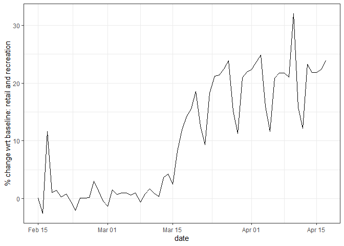
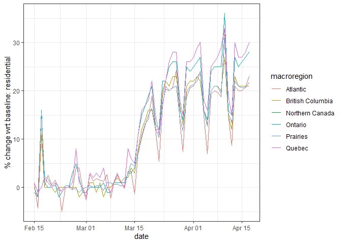
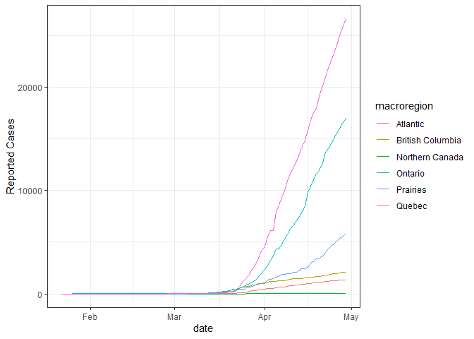
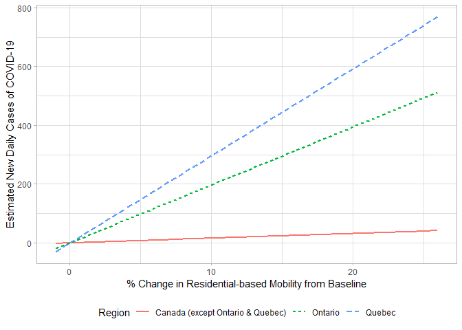

<!-- README.md is generated from README.Rmd. Please edit that file -->

# Google-COVID-19-Mobility-Reports

<!-- badges: start -->

<!-- badges: end -->

In this notebook I use `R` to retrieve Google’s [community mobility
reports](https://www.google.com/covid19/mobility/). These reports are
being released by Google to support public health experts and the public
understand the way mobility has changed with respect to a baseline level
for the duration of the COVID-19 pandemic. I was inspired to do this
after seeing Theo Lim’s GitHub
[repository](https://github.com/theochli/google_covid_mobility_map) with
Python code to download the reports and visualize the data. This is
mostly an example of how to retrieve data, and I will add analysis as I
can.

Reports are presented by location with variations; for instance,
Canada’s community mobility reports are given at the national and
provincial levels. For some countries the reports are given only at the
national level. For the US the reports are at the level of counties.
Each report includes the percent change in visits to places like grocery
stores and parks within the designated geographic area. The baseline is
the median value, for the corresponding day of the week, during the
5-week period between January, 3rd and February 6th, 2020. Given
seasonality in mobility, it would probably have been better to use a
baseline of the corresponding day of the week for a moving window of 5
or whatever weeks, but of the previous year. I wonder if those data from
previous years even exist.

The categories of places are as follows:

  - Grocery & pharmacy: Mobility trends for places like grocery markets,
    food warehouses, farmers markets, specialty food shops, drug stores,
    and pharmacies.

  - Parks: Mobility trends for places like local parks, national parks,
    public beaches, marinas, dog parks, plazas, and public gardens.

  - Transit stations: Mobility trends for places like public transport
    hubs such as subway, bus, and train stations.

  - Retail & recreation: Mobility trends for places like restaurants,
    cafes, shopping centers, theme parks, museums, libraries, and movie
    theaters.

  - Residential: Mobility trends for places of residence.

  - Workplaces: Mobility trends for places of work.

More information about the data can be found
[here](https://www.google.com/covid19/mobility/data_documentation.html?hl=en).

## Preliminaries

Load the packages needed to read and work with the data:

``` r
library(countrycode)
library(gridExtra)
library(interactions)
library(jtools)
library(lubridate)
library (RCurl)
library(tidyverse)
library(wppExplorer)
```

Retrieve data:

``` r
download <- getURL("https://www.gstatic.com/covid19/mobility/Global_Mobility_Report.csv?cachebust=911a386b6c9c230f")
gmobility <- read.csv (text = download)
```

Save as RData. I created a folder called `data` to keep a local copy of
the mobility report:

``` r
save(gmobility, file = "data/gmobility.RData")
```

What are the contents of the report?

``` r
head(gmobility)
#>   country_region_code       country_region sub_region_1 sub_region_2       date
#> 1                  AE United Arab Emirates                           2020-02-15
#> 2                  AE United Arab Emirates                           2020-02-16
#> 3                  AE United Arab Emirates                           2020-02-17
#> 4                  AE United Arab Emirates                           2020-02-18
#> 5                  AE United Arab Emirates                           2020-02-19
#> 6                  AE United Arab Emirates                           2020-02-20
#>   retail_and_recreation_percent_change_from_baseline
#> 1                                                  0
#> 2                                                  1
#> 3                                                 -1
#> 4                                                 -2
#> 5                                                 -2
#> 6                                                 -2
#>   grocery_and_pharmacy_percent_change_from_baseline
#> 1                                                 4
#> 2                                                 4
#> 3                                                 1
#> 4                                                 1
#> 5                                                 0
#> 6                                                 1
#>   parks_percent_change_from_baseline
#> 1                                  5
#> 2                                  4
#> 3                                  5
#> 4                                  5
#> 5                                  4
#> 6                                  6
#>   transit_stations_percent_change_from_baseline
#> 1                                             0
#> 2                                             1
#> 3                                             1
#> 4                                             0
#> 5                                            -1
#> 6                                             1
#>   workplaces_percent_change_from_baseline
#> 1                                       2
#> 2                                       2
#> 3                                       2
#> 4                                       2
#> 5                                       2
#> 6                                       1
#>   residential_percent_change_from_baseline
#> 1                                        1
#> 2                                        1
#> 3                                        1
#> 4                                        1
#> 5                                        1
#> 6                                        1
```

The unit of the report is a combination of region and date, and the
columns include the percent change from baseline for each category of
place.

Check the range of dates covered:

``` r
summary(gmobility$date)
#> 2020-02-15 2020-02-16 2020-02-17 2020-02-18 2020-02-19 2020-02-20 2020-02-21 
#>       3808       3673       4016       3995       4002       4000       3981 
#> 2020-02-22 2020-02-23 2020-02-24 2020-02-25 2020-02-26 2020-02-27 2020-02-28 
#>       3811       3669       3979       3997       3992       3991       3977 
#> 2020-02-29 2020-03-01 2020-03-02 2020-03-03 2020-03-04 2020-03-05 2020-03-06 
#>       3800       3645       3973       3991       3995       3990       3982 
#> 2020-03-07 2020-03-08 2020-03-09 2020-03-10 2020-03-11 2020-03-12 2020-03-13 
#>       3795       3646       3974       3989       3995       3993       3985 
#> 2020-03-14 2020-03-15 2020-03-16 2020-03-17 2020-03-18 2020-03-19 2020-03-20 
#>       3806       3663       3995       4031       4039       4041       4037 
#> 2020-03-21 2020-03-22 2020-03-23 2020-03-24 2020-03-25 2020-03-26 2020-03-27 
#>       3826       3693       4041       4055       4057       4062       4038 
#> 2020-03-28 2020-03-29 2020-03-30 2020-03-31 2020-04-01 2020-04-02 2020-04-03 
#>       3842       3712       4052       4067       4062       4072       4051 
#> 2020-04-04 2020-04-05 2020-04-06 2020-04-07 2020-04-08 2020-04-09 2020-04-10 
#>       3843       3715       4038       4059       4056       4062       4041 
#> 2020-04-11 2020-04-12 2020-04-13 2020-04-14 2020-04-15 2020-04-16 2020-04-17 
#>       3447       1034       1129       1131       1129       1130       1128
```

The earliest date reported for any geographical location February 15,
2020. However, the `date` is stored as a factor which is not ideal work
with times; I will change it to date:

``` r
gmobility <- gmobility %>%
  mutate(date = lubridate::ymd(date))
```

Summarize the dates again:

``` r
summary(gmobility$date)
#>         Min.      1st Qu.       Median         Mean      3rd Qu.         Max. 
#> "2020-02-15" "2020-02-29" "2020-03-15" "2020-03-14" "2020-03-30" "2020-04-17"
```

That is better. Now it is clear that the earliest date is Feb. 15, 2020
(the minimum value) and the latest (for the time being) is Apr. 17,
2020.

With this more or less the community reports are in workable shape.

## How has mobility in Canada changed according to Google?

To begin an exploration of mobility in Canada (according to Google), the
first step is to filter the dataframe to include only Canadian data (I’m
calling this “cmr” for “community mobility report”):

``` r
canada_cmr <- gmobility %>%
  filter(country_region == "Canada") %>%
  droplevels()
```

We can quickly check the contents of this Canadian dataframe:

``` r
summary(canada_cmr)
#>  country_region_code country_region                    sub_region_1
#>  CA:875              Canada:875                              : 63  
#>                                     Alberta                  : 63  
#>                                     British Columbia         : 63  
#>                                     Manitoba                 : 63  
#>                                     New Brunswick            : 63  
#>                                     Newfoundland and Labrador: 63  
#>                                     (Other)                  :497  
#>  sub_region_2      date           
#>  :875         Min.   :2020-02-15  
#>               1st Qu.:2020-03-01  
#>               Median :2020-03-17  
#>               Mean   :2020-03-17  
#>               3rd Qu.:2020-04-02  
#>               Max.   :2020-04-17  
#>                                   
#>  retail_and_recreation_percent_change_from_baseline
#>  Min.   :-85.00                                    
#>  1st Qu.:-49.00                                    
#>  Median :-17.00                                    
#>  Mean   :-21.82                                    
#>  3rd Qu.:  4.00                                    
#>  Max.   : 57.00                                    
#>  NA's   :49                                        
#>  grocery_and_pharmacy_percent_change_from_baseline
#>  Min.   :-79.000                                  
#>  1st Qu.:-21.000                                  
#>  Median : -2.000                                  
#>  Mean   : -6.169                                  
#>  3rd Qu.:  6.000                                  
#>  Max.   : 64.000                                  
#>  NA's   :80                                       
#>  parks_percent_change_from_baseline
#>  Min.   :-68.000                   
#>  1st Qu.:-19.000                   
#>  Median :  0.000                   
#>  Mean   :  2.249                   
#>  3rd Qu.: 16.000                   
#>  Max.   :202.000                   
#>  NA's   :244                       
#>  transit_stations_percent_change_from_baseline
#>  Min.   :-83                                  
#>  1st Qu.:-61                                  
#>  Median :-39                                  
#>  Mean   :-32                                  
#>  3rd Qu.: -1                                  
#>  Max.   : 35                                  
#>  NA's   :217                                  
#>  workplaces_percent_change_from_baseline
#>  Min.   :-86.0                          
#>  1st Qu.:-49.0                          
#>  Median :-29.0                          
#>  Mean   :-25.7                          
#>  3rd Qu.:  1.0                          
#>  Max.   : 36.0                          
#>  NA's   :23                             
#>  residential_percent_change_from_baseline
#>  Min.   :-7.00                           
#>  1st Qu.: 1.00                           
#>  Median :10.50                           
#>  Mean   :10.51                           
#>  3rd Qu.:20.00                           
#>  Max.   :36.00                           
#>  NA's   :201
```

Now we have an All-Canadian dataset with the highest geographical level
of resolution the province. At this point, I am going to rename the
annoyingly long names of the columns to something more practical (after
all, I know that all these variables are “percent change from
baseline”):

``` r
canada_cmr <- canada_cmr %>%
  rename(r_and_r = retail_and_recreation_percent_change_from_baseline, 
         g_and_p = grocery_and_pharmacy_percent_change_from_baseline, 
         parks = parks_percent_change_from_baseline,
         transit = transit_stations_percent_change_from_baseline, 
         work = workplaces_percent_change_from_baseline,
         residential = residential_percent_change_from_baseline)
```

Another thing that we notice is that there are quite a few “NAs” in the
table. These could be data that have been censored by Google to comply
with their [Privacy
Policy](https://www.google.com/covid19/mobility/index.html?hl=en).
Maybe. But that seems like a little bit of a stretch, given that the
aggregation is at the provincial level. Or it could be that in fact
there are relatively few people in some provinces at certain times who
allow Google to track them. Or could the “NAs” be that on certain dates
there were absolutely no trips to those places? What would be the
percentage change from the baseline to zero?

We can explore this question by looking at where the “NAs” are:

``` r
canada_cmr %>% 
  filter(is.na(r_and_r)) %>%
  select(sub_region_1) %>%
  table()
#> .
#>                                             Alberta          British Columbia 
#>                         0                         0                         0 
#>                  Manitoba             New Brunswick Newfoundland and Labrador 
#>                         0                         0                         0 
#>     Northwest Territories               Nova Scotia                   Nunavut 
#>                        12                         0                        25 
#>                   Ontario      Prince Edward Island                    Quebec 
#>                         0                         0                         0 
#>              Saskatchewan                     Yukon 
#>                         0                        12
```

Ah. So the “NAs” are concentrated in the Northwest Territories, Nunavut,
and Yukon, all sparsely populated regions; likely the “NAs” then are a
result of censoring due to small numbers. Notice that there is also an
unlabeled “region”. This are in fact the national-level statistics.

We can verify that this is the case too with the other categories of
places, like groceries and pharmacies:

``` r
canada_cmr %>% 
  filter(is.na(g_and_p)) %>%
  select(sub_region_1) %>%
  table()
#> .
#>                                             Alberta          British Columbia 
#>                         0                         0                         0 
#>                  Manitoba             New Brunswick Newfoundland and Labrador 
#>                         0                         0                         0 
#>     Northwest Territories               Nova Scotia                   Nunavut 
#>                        12                         0                        56 
#>                   Ontario      Prince Edward Island                    Quebec 
#>                         0                         0                         0 
#>              Saskatchewan                     Yukon 
#>                         0                        12
```

Parks:

``` r
canada_cmr %>% 
  filter(is.na(parks)) %>%
  select(sub_region_1) %>%
  table()
#> .
#>                                             Alberta          British Columbia 
#>                         0                         0                         0 
#>                  Manitoba             New Brunswick Newfoundland and Labrador 
#>                         0                         0                         0 
#>     Northwest Territories               Nova Scotia                   Nunavut 
#>                        63                         0                        56 
#>                   Ontario      Prince Edward Island                    Quebec 
#>                         0                        62                         0 
#>              Saskatchewan                     Yukon 
#>                         0                        63
```

In addition to the three regions identified before, Prince Edward Island
also has “NAs” in the category of parks.

Transit:

``` r
canada_cmr %>% 
  filter(is.na(transit)) %>%
  select(sub_region_1) %>%
  table()
#> .
#>                                             Alberta          British Columbia 
#>                         0                         0                         0 
#>                  Manitoba             New Brunswick Newfoundland and Labrador 
#>                         0                         0                         0 
#>     Northwest Territories               Nova Scotia                   Nunavut 
#>                        35                         0                        56 
#>                   Ontario      Prince Edward Island                    Quebec 
#>                         0                        63                         0 
#>              Saskatchewan                     Yukon 
#>                         0                        63
```

Work:

``` r
canada_cmr %>% 
  filter(is.na(work)) %>%
  select(sub_region_1) %>%
  table()
#> .
#>                                             Alberta          British Columbia 
#>                         0                         0                         0 
#>                  Manitoba             New Brunswick Newfoundland and Labrador 
#>                         0                         0                         0 
#>     Northwest Territories               Nova Scotia                   Nunavut 
#>                         5                         0                         6 
#>                   Ontario      Prince Edward Island                    Quebec 
#>                         0                         0                         0 
#>              Saskatchewan                     Yukon 
#>                         0                        12
```

Residential:

``` r
canada_cmr %>% 
  filter(is.na(work)) %>%
  select(sub_region_1) %>%
  table()
#> .
#>                                             Alberta          British Columbia 
#>                         0                         0                         0 
#>                  Manitoba             New Brunswick Newfoundland and Labrador 
#>                         0                         0                         0 
#>     Northwest Territories               Nova Scotia                   Nunavut 
#>                         5                         0                         6 
#>                   Ontario      Prince Edward Island                    Quebec 
#>                         0                         0                         0 
#>              Saskatchewan                     Yukon 
#>                         0                        12
```

Now, there are different ways in which these data could be analyzed
(obviously), but I will begin with data at the national level. I could
remove the provinces/territories with “NAs”, or I could include them and
ignore the records that are missing. I’ll do the latter.

Create a plot of the changes in mobility with respect to retail and
recreation, taking the daily average of all provinces (taking care of
removing the “NAs” from the calculation of the mean, so using na.rm =
TRUE):

``` r
canada_cmr %>%
  group_by(date) %>%
  summarize (r_and_r = mean(r_and_r, na.rm = TRUE)) %>%
  ggplot(aes(x = date, y = r_and_r)) +
  geom_line() +
  theme_bw() +
  ylab("% change wrt baseline: retail and recreation")
```

<!-- -->

We see that, at the national level, the mobility hovered close to the
baseline (percent change \~ 0) until March 13, which is when social
distancing measures started to be phased in across the country. Mobility
with respect to retail and recreation after that date collapsed to about
-50% change with respect to the baseline, and hovered there (with
additional drops in the second week of April).

But did this change similarly across the country? Repeat the plot, but
by macro-region. I will add the macro-regions to the dataframe:

``` r
canada_cmr <- canada_cmr %>%
  mutate(macroregion = case_when(sub_region_1 == "Ontario" ~ "Ontario",
                                 sub_region_1 == "Quebec" ~ "Quebec",
                                 sub_region_1 == "British Columbia" ~ "British Columbia",
                                 sub_region_1 == "Manitoba" | 
                                   sub_region_1 == "Saskatchewan" | 
                                   sub_region_1 == "Alberta"  ~ "Prairies",
                                 sub_region_1 == "New Brunswick" | 
                                   sub_region_1 == "Newfoundland and Labrador" | 
                                   sub_region_1 == "Nova Scotia" | 
                                   sub_region_1 == "Prince Edward Island"  ~ "Atlantic",
                                 sub_region_1 == "Northwest Territories" | 
                                   sub_region_1 == "Nunavut" | 
                                   sub_region_1 == "Yukon" ~ "Northern Canada"),
         macroregion = factor(macroregion))
```

``` r
canada_cmr %>%
  drop_na(macroregion) %>%
  group_by(date, macroregion) %>%
  summarize (r_and_r = mean(r_and_r, na.rm = TRUE)) %>%
  ggplot(aes(x = date, y = r_and_r, color = macroregion)) +
  geom_line() +
  theme_bw() +
  ylab("% change wrt baseline: retail and recreation")
#> Warning: Removed 12 row(s) containing missing values (geom_path).
```

<!-- -->

Here, we see that Quebec has had the largest changes in
retail-and-recreation-related mobility of all regions, whereas Northern
Canada has had the least (albeit still quite considerable)(but we don’t
know what was the baseline; if the base line was low mobility, then
there was maybe not much that could be cut).

With most form of mobility severely curtailed by social distancing
mandates, residential-based mobility is perhaps the form of mobility
that dominates during the pandemic. The following plot shows how
residential-based mobility has changed (as before, this is the daily
average of all provinces, after removing the “NAs” from the calculation
of the mean):

``` r
canada_cmr %>%
  group_by(date) %>%
  summarize (residential = mean(residential, na.rm = TRUE)) %>%
  ggplot(aes(x = date, y = residential)) +
  geom_line() +
  theme_bw() +
  ylab("% change wrt baseline: retail and recreation")
```

<!-- -->

Whereas retail and recreation-related mobility has collapsed,
residential-based mobility as increased following the orders that
restricted non-essential travel. This is not necessarily surprising:
time-use research by Canadian researchers [Harvey and Taylor
(2000)](https://link.springer.com/article/10.1023/A:1005207320044) had
shown that working from home did not necessarily reduce travel, but
instead shifted its purpose. These researchers argue that people tend to
seek social contact, and when social contact is not available through
attendance to a workplace, place of study, etc., that they will shift
their travel to other matters.

What where the changes in residential-based mobility by region?

``` r
canada_cmr %>%
  drop_na(macroregion) %>%
  group_by(date, macroregion) %>%
  summarize (residential = mean(residential, na.rm = TRUE)) %>%
  ggplot(aes(x = date, y = residential, color = macroregion)) +
  geom_line() +
  theme_bw() +
  ylab("% change wrt baseline: residential")
#> Warning: Removed 63 row(s) containing missing values (geom_path).
```

<!-- -->

Interestingly, we see that residential-based mobility grew more in the
place where retail and recreation mobility dropped most.

## COVID-19 cases from Johns Hopkins University

``` r
baseURL = "https://raw.githubusercontent.com/CSSEGISandData/COVID-19/master/csse_covid_19_data/csse_covid_19_time_series"

covid19 = read.csv(file.path("https://raw.githubusercontent.com/CSSEGISandData/COVID-19/master/csse_covid_19_data/csse_covid_19_time_series",
                           "time_series_covid19_confirmed_global.csv"),
                 check.names=FALSE, 
                 stringsAsFactors=FALSE) %>%
  select(-Lat, -Long) %>% 
  pivot_longer(-(1:2), names_to = "date", values_to = "Cases") %>% 
  mutate(date=as.Date(date, format="%m/%d/%y"),
         `Country/Region`=if_else(`Country/Region` == "", "?", `Country/Region`),
         `Province/State`=if_else(`Province/State` == "", "<all>", `Province/State`))
```

Save as RData. This is going to the same folder where I saved the
community mobility reports:

``` r
save(covid19, file = "data/covid19_jhu.RData")
```

Filter data for Canada and convert variables to factors/date, as
appropriate:

``` r
Country <- "Canada"
country_code <- countrycode(Country, origin = "country.name", destination = "iso2c")
canada_c19 <- covid19 %>%
  filter(`Country/Region` == Country) %>%
  transmute(Province = factor(`Province/State`),
            Country = factor(`Country/Region`),
            date = ymd(date),
            Cases)
```

We can also add to the dataframe the macro-regions:

``` r
canada_c19 <- canada_c19 %>%
  mutate(macroregion = case_when(Province == "Ontario" ~ "Ontario",
                                 Province == "Quebec" ~ "Quebec",
                                 Province == "British Columbia" ~ "British Columbia",
                                 Province == "Manitoba" | 
                                   Province == "Saskatchewan" | 
                                   Province == "Alberta"  ~ "Prairies",
                                 Province == "New Brunswick" | 
                                   Province == "Newfoundland and Labrador" | 
                                   Province == "Nova Scotia" | 
                                   Province == "Prince Edward Island"  ~ "Atlantic",
                                 Province == "Northwest Territories" | 
                                   Province == "Nunavut" | 
                                   Province == "Yukon" ~ "Northern Canada"),
         macroregion = factor(macroregion))
```

Summarize the contents of the dataframe:

``` r
summary(canada_c19)
#>              Province     Country          date                Cases        
#>  Alberta         : 99   Canada:1485   Min.   :2020-01-22   Min.   :    0.0  
#>  British Columbia: 99                 1st Qu.:2020-02-15   1st Qu.:    0.0  
#>  Diamond Princess: 99                 Median :2020-03-11   Median :    0.0  
#>  Grand Princess  : 99                 Mean   :2020-03-11   Mean   :  624.7  
#>  Manitoba        : 99                 3rd Qu.:2020-04-05   3rd Qu.:   36.0  
#>  New Brunswick   : 99                 Max.   :2020-04-29   Max.   :26610.0  
#>  (Other)         :891                                                       
#>            macroregion 
#>  Atlantic        :396  
#>  British Columbia: 99  
#>  Northern Canada :198  
#>  Ontario         : 99  
#>  Prairies        :297  
#>  Quebec          : 99  
#>  NA's            :297
```

The earliest date in this dataframe is January 22, 2020, and there are
cases at the provincial level by date. The “NAs” are cases attributed to
two cruises (“Grand Princess” and “Diamond Princess”), and recovered
cases. These can be removed from the dataframe:

``` r
canada_c19 <- canada_c19 %>%
  drop_na()
```

It is important to note that “Cases” is not the *actual* number of cases
(nobody really knows that, although there are estimates of those), but
number of *reported* cases. We can see the growth in reported cases by
macro-region in the following plot:

``` r
canada_c19 %>%
  drop_na(macroregion) %>%
  group_by(date, macroregion) %>%
  summarize (Cases = sum(Cases)) %>%
  ggplot(aes(x = date, y = Cases, color = macroregion)) +
  geom_line() +
  theme_bw() +
  ylab("Reported Cases")
```

<!-- -->

Quebec has in Canada the largest number of reported cases, followed by
Ontario. To calculate the number of new daily cases, we need to lag the
Cases variable and substract the previous total:

``` r
canada_c19 <- canada_c19 %>%
  group_by(Province) %>%
  mutate(new_cases = Cases - lag(Cases, 1)) %>%
  ungroup()
```

The summary of this now shows that the number of new cases ranges from
-7 (probably some cases that were retracted) to a maximum of NA new
daily cases for any province:

``` r
summary(canada_c19)
#>                       Province     Country          date           
#>  Alberta                  : 99   Canada:1188   Min.   :2020-01-22  
#>  British Columbia         : 99                 1st Qu.:2020-02-15  
#>  Manitoba                 : 99                 Median :2020-03-11  
#>  New Brunswick            : 99                 Mean   :2020-03-11  
#>  Newfoundland and Labrador: 99                 3rd Qu.:2020-04-05  
#>  Northwest Territories    : 99                 Max.   :2020-04-29  
#>  (Other)                  :594                                     
#>      Cases                   macroregion    new_cases      
#>  Min.   :    0.0   Atlantic        :396   Min.   :  -7.00  
#>  1st Qu.:    0.0   British Columbia: 99   1st Qu.:   0.00  
#>  Median :    3.0   Northern Canada :198   Median :   0.00  
#>  Mean   :  780.4   Ontario         : 99   Mean   :  44.94  
#>  3rd Qu.:  120.2   Prairies        :297   3rd Qu.:   4.00  
#>  Max.   :26610.0   Quebec          : 99   Max.   :1843.00  
#>                                           NA's   :12
```

## Combine the community mobility reports with new COVID-19 cases in Canada

The potential salutary effect of the lockdown (measured in terms of
reduced mobility) are not immediate, given the incubation period of the
disease. The incubation period has been estimated to be between 2 and 11
days (95% interval) by [Lauer et
al. (2020)](https://annals.org/aim/fullarticle/2762808/incubation-period-coronavirus-disease-2019-covid-19-from-publicly-reported).
If we wanted to explore the way reduced mobility correlates with number
of new cases, we would need to lag the mobility variables by some
period. Here, I try two different ways of lagging the mobility
variables: a lagged moving average of date-minus-11-days to date-minus-2
days, and a lagged moving *weighted* average of date-minus-11-days to
date-minus-2 days (the weights are calculated based on the log-normal
distribution reported by Lauer et al.)

First, calculate the weights using the parameters reported by Lauer et
al. (2020). For this I will remove the provinces with missing values in
their community mobility reports:

``` r
# Calculate the p-values for the temporal weights
tweights <- data.frame(x = seq(2, 12, 1), p = dlnorm(seq(2, 12, 1), meanlog = 1.621, sdlog = 0.418))

# Sum, to normalize to one
ptotal <- sum(tweights$p)

# Weights are the normalized p-values
tweights <- tweights %>%
  mutate(w = p/ptotal)

tweights <- rbind(data.frame(x = 1, p = 0, w = 0), tweights)
```

Next, calculate the unweighted moving average for each mobility
indicator (call this lag *lag11*):

``` r
# Lagged r_and_r: 11 day moving average
r_and_r_lag11 <- canada_cmr %>% 
  group_by(sub_region_1) %>%
  group_modify(~ {((lag(.x$r_and_r, 12) + 
                      lag(.x$r_and_r, 11) + 
                      lag(.x$r_and_r, 10) + 
                      lag(.x$r_and_r, 9) + 
                      lag(.x$r_and_r, 8) + 
                      lag(.x$r_and_r, 7) + 
                      lag(.x$r_and_r, 6) + 
                      lag(.x$r_and_r, 5) + 
                      lag(.x$r_and_r, 4) + 
                      lag(.x$r_and_r, 3) + 
                      lag(.x$r_and_r, 2))/11) %>%
      enframe()}) %>%
  ungroup() %>% 
  filter(sub_region_1 != "" & 
           sub_region_1 != "Nunavut" &  
           sub_region_1 != "Northwestern Territories" &
           sub_region_1 != "Prince Edward Island" &
           sub_region_1 != "Yukon") %>%
  transmute(sub_region_1 = as.character(sub_region_1), 
            Date = rep(seq(min(canada_cmr$date),
                           max(canada_cmr$date), 
                           by = "days"), 
                       10), 
            Mean_r_and_r_lag11 = value)

# Lagged g_and_p: 11 day moving average
g_and_p_lag11 <- canada_cmr %>% 
  group_by(sub_region_1) %>%
  group_modify(~ {((lag(.x$g_and_p, 12) + 
                      lag(.x$g_and_p, 11) + 
                      lag(.x$g_and_p, 10) + 
                      lag(.x$g_and_p, 9) + 
                      lag(.x$g_and_p, 8) + 
                      lag(.x$g_and_p, 7) + 
                      lag(.x$g_and_p, 6) + 
                      lag(.x$g_and_p, 5) + 
                      lag(.x$g_and_p, 4) + 
                      lag(.x$g_and_p, 3) + 
                      lag(.x$g_and_p, 2))/11) %>%
      enframe()}) %>%
  ungroup() %>% 
  filter(sub_region_1 != "" & 
           sub_region_1 != "Nunavut" & 
           sub_region_1 != "Northwestern Territories" &
           sub_region_1 != "Prince Edward Island" &
           sub_region_1 != "Yukon") %>%
  transmute(sub_region_1 = as.character(sub_region_1), 
            Date = rep(seq(min(canada_cmr$date),
                           max(canada_cmr$date), 
                           by = "days"), 
                       10), 
            Mean_g_and_p_lag11 = value)

# Lagged parks: 11 day moving average
parks_lag11 <- canada_cmr %>% 
  group_by(sub_region_1) %>%
  group_modify(~ {((lag(.x$parks, 12) + 
                      lag(.x$parks, 11) + 
                      lag(.x$parks, 10) + 
                      lag(.x$parks, 9) + 
                      lag(.x$parks, 8) + 
                      lag(.x$parks, 7) + 
                      lag(.x$parks, 6) + 
                      lag(.x$parks, 5) + 
                      lag(.x$parks, 4) + 
                      lag(.x$parks, 3) + 
                      lag(.x$parks, 2))/11) %>%
      enframe()}) %>%
  ungroup() %>% 
  filter(sub_region_1 != "" & 
           sub_region_1 != "Nunavut" & 
           sub_region_1 != "Northwestern Territories" &
           sub_region_1 != "Prince Edward Island" &
           sub_region_1 != "Yukon") %>%
  transmute(sub_region_1 = as.character(sub_region_1), 
            Date = rep(seq(min(canada_cmr$date),
                           max(canada_cmr$date), 
                           by = "days"), 
                       10), 
            Mean_parks_lag11 = value)

# Lagged transit: 11 day moving average
transit_lag11 <- canada_cmr %>% 
  group_by(sub_region_1) %>%
  group_modify(~ {((lag(.x$transit, 12) + 
                      lag(.x$transit, 11) + 
                      lag(.x$transit, 10) + 
                      lag(.x$transit, 9) + 
                      lag(.x$transit, 8) + 
                      lag(.x$transit, 7) + 
                      lag(.x$transit, 6) + 
                      lag(.x$transit, 5) + 
                      lag(.x$transit, 4) + 
                      lag(.x$transit, 3) + 
                      lag(.x$transit, 2))/11) %>%
      enframe()}) %>%
  ungroup() %>% 
  filter(sub_region_1 != "" & 
           sub_region_1 != "Nunavut" & 
           sub_region_1 != "Northwestern Territories" &
           sub_region_1 != "Prince Edward Island" &
           sub_region_1 != "Yukon"  ) %>%
  transmute(sub_region_1 = as.character(sub_region_1), 
            Date = rep(seq(min(canada_cmr$date),
                           max(canada_cmr$date), 
                           by = "days"), 
                       10), 
            Mean_transit_lag11 = value)

# Lagged work: 11 day moving average
work_lag11 <- canada_cmr %>% 
  group_by(sub_region_1) %>%
  group_modify(~ {((lag(.x$work, 12) + 
                      lag(.x$work, 11) + 
                      lag(.x$work, 10) + 
                      lag(.x$work, 9) + 
                      lag(.x$work, 8) + 
                      lag(.x$work, 7) + 
                      lag(.x$work, 6) + 
                      lag(.x$work, 5) + 
                      lag(.x$work, 4) + 
                      lag(.x$work, 3) + 
                      lag(.x$work, 2))/11) %>%
      enframe()}) %>%
  ungroup() %>% 
  filter(sub_region_1 != "" & 
           sub_region_1 != "Nunavut" & 
           sub_region_1 != "Northwestern Territories" &
           sub_region_1 != "Prince Edward Island" &
           sub_region_1 != "Yukon") %>%
  transmute(sub_region_1 = as.character(sub_region_1), 
            Date = rep(seq(min(canada_cmr$date),
                           max(canada_cmr$date), 
                           by = "days"), 
                       10), 
            Mean_work_lag11 = value)

# Lagged residential: 11 day moving average
residential_lag11 <- canada_cmr %>% 
  group_by(sub_region_1) %>%
  group_modify(~ {((lag(.x$residential, 12) + 
                      lag(.x$residential, 11) + 
                      lag(.x$residential, 10) + 
                      lag(.x$residential, 9) + 
                      lag(.x$residential, 8) + 
                      lag(.x$residential, 7) + 
                      lag(.x$residential, 6) + 
                      lag(.x$residential, 5) + 
                      lag(.x$residential, 4) + 
                      lag(.x$residential, 3) + 
                      lag(.x$residential, 2))/11) %>%
      enframe()}) %>%
  ungroup() %>% 
  filter(sub_region_1 != "" & 
           sub_region_1 != "Nunavut" &
           sub_region_1 != "Northwestern Territories" &
           sub_region_1 != "Prince Edward Island" &
           sub_region_1 != "Yukon") %>%
  transmute(sub_region_1 = as.character(sub_region_1), 
            Date = rep(seq(min(canada_cmr$date),
                           max(canada_cmr$date), 
                           by = "days"), 
                       10), 
            Mean_residential_lag11 = value)
```

Next, calculate the weighted moving average for each mobility indicator
(call this lag *lag11w*):

``` r
# Lagged r_and_r: 11 day moving average
r_and_r_lag11w <- canada_cmr %>% 
  group_by(sub_region_1) %>%
  group_modify(~ {((lag(.x$r_and_r, 12) * tweights$w[12] + 
                      lag(.x$r_and_r, 11) * tweights$w[11] + 
                      lag(.x$r_and_r, 10) * tweights$w[10] + 
                      lag(.x$r_and_r, 9) * tweights$w[9] + 
                      lag(.x$r_and_r, 8) * tweights$w[8] + 
                      lag(.x$r_and_r, 7) * tweights$w[7] + 
                      lag(.x$r_and_r, 6) * tweights$w[6] + 
                      lag(.x$r_and_r, 5) * tweights$w[5] + 
                      lag(.x$r_and_r, 4) * tweights$w[4] + 
                      lag(.x$r_and_r, 3) * tweights$w[3] + 
                      lag(.x$r_and_r, 2) * tweights$w[2])/11) %>%
      enframe()}) %>%
  ungroup() %>% 
  filter(sub_region_1 != "" & 
           sub_region_1 != "Nunavut" &  
           sub_region_1 != "Northwestern Territories" & 
           sub_region_1 != "Prince Edward Island" & 
           sub_region_1 != "Yukon") %>%
  transmute(sub_region_1 = as.character(sub_region_1), 
            Date = rep(seq(min(canada_cmr$date),
                           max(canada_cmr$date), 
                           by = "days"), 
                       10), 
            Mean_r_and_r_lag11w = value)

# Lagged g_and_p: 11 day moving average
g_and_p_lag11w <- canada_cmr %>% 
  group_by(sub_region_1) %>%
  group_modify(~ {((lag(.x$g_and_p, 12) * tweights$w[12] + 
                      lag(.x$g_and_p, 11) * tweights$w[11] + 
                      lag(.x$g_and_p, 10) * tweights$w[10] + 
                      lag(.x$g_and_p, 9) * tweights$w[9] + 
                      lag(.x$g_and_p, 8) * tweights$w[8] + 
                      lag(.x$g_and_p, 7) * tweights$w[7] + 
                      lag(.x$g_and_p, 6) * tweights$w[6] + 
                      lag(.x$g_and_p, 5) * tweights$w[5] + 
                      lag(.x$g_and_p, 4) * tweights$w[4] + 
                      lag(.x$g_and_p, 3) * tweights$w[3] + 
                      lag(.x$g_and_p, 2) * tweights$w[2])/11) %>%
      enframe()}) %>%
  ungroup() %>% 
  filter(sub_region_1 != "" & 
           sub_region_1 != "Nunavut" &  
           sub_region_1 != "Northwestern Territories"  & 
           sub_region_1 != "Prince Edward Island"  & 
           sub_region_1 != "Yukon") %>%
  transmute(sub_region_1 = as.character(sub_region_1), 
            Date = rep(seq(min(canada_cmr$date),
                           max(canada_cmr$date), 
                           by = "days"), 
                       10), 
            Mean_g_and_p_lag11w = value)

# Lagged parks: 11 day moving average
parks_lag11w <- canada_cmr %>% 
  group_by(sub_region_1) %>%
  group_modify(~ {((lag(.x$parks, 12) * tweights$w[12] + 
                      lag(.x$parks, 11) * tweights$w[11] + 
                      lag(.x$parks, 10) * tweights$w[10] + 
                      lag(.x$parks, 9) * tweights$w[9] + 
                      lag(.x$parks, 8) * tweights$w[8] + 
                      lag(.x$parks, 7) * tweights$w[7] + 
                      lag(.x$parks, 6) * tweights$w[6] + 
                      lag(.x$parks, 5) * tweights$w[5] + 
                      lag(.x$parks, 4) * tweights$w[4] + 
                      lag(.x$parks, 3) * tweights$w[3] + 
                      lag(.x$parks, 2) * tweights$w[2])/11) %>%
      enframe()}) %>%
  ungroup() %>% 
  filter(sub_region_1 != "" & 
           sub_region_1 != "Nunavut" &  
           sub_region_1 != "Northwestern Territories"  & 
           sub_region_1 != "Prince Edward Island"  & 
           sub_region_1 != "Yukon") %>%
  transmute(sub_region_1 = as.character(sub_region_1), 
            Date = rep(seq(min(canada_cmr$date),
                           max(canada_cmr$date), 
                           by = "days"), 
                       10), 
            Mean_parks_lag11w = value)

# Lagged transit: 11 day moving average
transit_lag11w <- canada_cmr %>% 
  group_by(sub_region_1) %>%
  group_modify(~ {((lag(.x$transit, 12) * tweights$w[12] + 
                      lag(.x$transit, 11) * tweights$w[10] + 
                      lag(.x$transit, 10) * tweights$w[11] + 
                      lag(.x$transit, 9) * tweights$w[9] + 
                      lag(.x$transit, 8) * tweights$w[8] + 
                      lag(.x$transit, 7) * tweights$w[7] + 
                      lag(.x$transit, 6) * tweights$w[6] + 
                      lag(.x$transit, 5) * tweights$w[5] + 
                      lag(.x$transit, 4) * tweights$w[4] + 
                      lag(.x$transit, 3) * tweights$w[3] + 
                      lag(.x$transit, 2) * tweights$w[2])/11) %>%
      enframe()}) %>%
  ungroup() %>% 
  filter(sub_region_1 != "" & 
           sub_region_1 != "Nunavut" &  
           sub_region_1 != "Northwestern Territories"  & 
           sub_region_1 != "Prince Edward Island"  & 
           sub_region_1 != "Yukon") %>%
  transmute(sub_region_1 = as.character(sub_region_1), 
            Date = rep(seq(min(canada_cmr$date),
                           max(canada_cmr$date), 
                           by = "days"), 
                       10), 
            Mean_transit_lag11w = value)

# Lagged work: 11 day moving average
work_lag11w <- canada_cmr %>% 
  group_by(sub_region_1) %>%
  group_modify(~ {((lag(.x$work, 12) * tweights$w[12] + 
                      lag(.x$work, 11) * tweights$w[11] + 
                      lag(.x$work, 10) * tweights$w[10] + 
                      lag(.x$work, 9) * tweights$w[9] + 
                      lag(.x$work, 8) * tweights$w[8] + 
                      lag(.x$work, 7) * tweights$w[7] + 
                      lag(.x$work, 6) * tweights$w[6] + 
                      lag(.x$work, 5) * tweights$w[5] + 
                      lag(.x$work, 4) * tweights$w[4] + 
                      lag(.x$work, 3) * tweights$w[3] + 
                      lag(.x$work, 2) * tweights$w[2])/11) %>%
      enframe()}) %>%
  ungroup() %>% 
  filter(sub_region_1 != "" & 
           sub_region_1 != "Nunavut" &  
           sub_region_1 != "Northwestern Territories"  & 
           sub_region_1 != "Prince Edward Island"  & 
           sub_region_1 != "Yukon") %>%
  transmute(sub_region_1 = as.character(sub_region_1), 
            Date = rep(seq(min(canada_cmr$date),
                           max(canada_cmr$date), 
                           by = "days"), 
                       10), 
            Mean_work_lag11w = value)

# Lagged residential: 11 day moving average
residential_lag11w <- canada_cmr %>% 
  group_by(sub_region_1) %>%
  group_modify(~ {((lag(.x$residential, 12) * tweights$w[12] + 
                      lag(.x$residential, 11) * tweights$w[11] + 
                      lag(.x$residential, 10) * tweights$w[10] + 
                      lag(.x$residential, 9) * tweights$w[9] + 
                      lag(.x$residential, 8) * tweights$w[8] + 
                      lag(.x$residential, 7) * tweights$w[7] + 
                      lag(.x$residential, 6) * tweights$w[6] + 
                      lag(.x$residential, 5) * tweights$w[5] + 
                      lag(.x$residential, 4) * tweights$w[4] + 
                      lag(.x$residential, 3) * tweights$w[3] + 
                      lag(.x$residential, 2) * tweights$w[2])/11) %>%
      enframe()}) %>%
  ungroup() %>% 
  filter(sub_region_1 != "" & 
           sub_region_1 != "Nunavut" &  
           sub_region_1 != "Northwestern Territories"  & 
           sub_region_1 != "Prince Edward Island"  & 
           sub_region_1 != "Yukon") %>%
  transmute(sub_region_1 = as.character(sub_region_1), 
            Date = rep(seq(min(canada_cmr$date),
                           max(canada_cmr$date), 
                           by = "days"), 
                       10), 
            Mean_residential_lag11w = value)
```

Now we can join the lagged mobility indicators to the dataframe with
COVID-19 cases:

``` r
canada_c19 <- canada_c19 %>%
  mutate(Province = as.character(Province)) %>%
  left_join(r_and_r_lag11, by = c("Province" = "sub_region_1", "date" = "Date")) %>%
  left_join(r_and_r_lag11w, by = c("Province" = "sub_region_1", "date" = "Date")) %>%
  left_join(g_and_p_lag11, by = c("Province" = "sub_region_1", "date" = "Date")) %>%
  left_join(g_and_p_lag11w, by = c("Province" = "sub_region_1", "date" = "Date")) %>%
  left_join(parks_lag11, by = c("Province" = "sub_region_1", "date" = "Date")) %>%
  left_join(parks_lag11w, by = c("Province" = "sub_region_1", "date" = "Date")) %>%
  left_join(transit_lag11, by = c("Province" = "sub_region_1", "date" = "Date")) %>%
  left_join(transit_lag11w, by = c("Province" = "sub_region_1", "date" = "Date")) %>%
  left_join(work_lag11, by = c("Province" = "sub_region_1", "date" = "Date")) %>%
  left_join(work_lag11w, by = c("Province" = "sub_region_1", "date" = "Date")) %>%
  left_join(residential_lag11, by = c("Province" = "sub_region_1", "date" = "Date")) %>%
  left_join(residential_lag11w, by = c("Province" = "sub_region_1", "date" = "Date"))
```

A summary of the dataframe after joining the mobility indicators shows
that there are numerous “NAs”. This is because the coverage of the
mobility reports does not coincide with the coverage of JHU regarding
COVID-19. The use of lagged moving averages for the mobility indicators
means that some days at the beginning of the series of mobility are also
lost:

``` r
summary(canada_c19)
#>    Province           Country          date                Cases        
#>  Length:1188        Canada:1188   Min.   :2020-01-22   Min.   :    0.0  
#>  Class :character                 1st Qu.:2020-02-15   1st Qu.:    0.0  
#>  Mode  :character                 Median :2020-03-11   Median :    3.0  
#>                                   Mean   :2020-03-11   Mean   :  780.4  
#>                                   3rd Qu.:2020-04-05   3rd Qu.:  120.2  
#>                                   Max.   :2020-04-29   Max.   :26610.0  
#>                                                                         
#>            macroregion    new_cases       Mean_r_and_r_lag11
#>  Atlantic        :396   Min.   :  -7.00   Min.   :-64.727   
#>  British Columbia: 99   1st Qu.:   0.00   1st Qu.:-49.386   
#>  Northern Canada :198   Median :   0.00   Median :-13.727   
#>  Ontario         : 99   Mean   :  44.94   Mean   :-21.245   
#>  Prairies        :297   3rd Qu.:   4.00   3rd Qu.:  3.296   
#>  Quebec          : 99   Max.   :1843.00   Max.   : 13.636   
#>                         NA's   :12        NA's   :688       
#>  Mean_r_and_r_lag11w Mean_g_and_p_lag11 Mean_g_and_p_lag11w Mean_parks_lag11 
#>  Min.   :-6.0429     Min.   :-35.9091   Min.   :-3.5183     Min.   :-40.818  
#>  1st Qu.:-4.5498     1st Qu.:-18.6818   1st Qu.:-1.8964     1st Qu.:-13.318  
#>  Median :-1.9913     Median :  0.7727   Median : 0.0002     Median :  3.909  
#>  Mean   :-2.0972     Mean   : -4.8060   Mean   :-0.5137     Mean   :  2.147  
#>  3rd Qu.: 0.3438     3rd Qu.:  6.5682   3rd Qu.: 0.5684     3rd Qu.: 13.727  
#>  Max.   : 1.2462     Max.   : 20.2727   Max.   : 2.6325     Max.   : 54.273  
#>  NA's   :688         NA's   :688        NA's   :688         NA's   :729      
#>  Mean_parks_lag11w Mean_transit_lag11 Mean_transit_lag11w Mean_work_lag11   
#>  Min.   :-4.0168   Min.   :-73.5455   Min.   :-6.7176     Min.   :-64.6364  
#>  1st Qu.:-1.3999   1st Qu.:-58.7273   1st Qu.:-5.5181     1st Qu.:-49.1136  
#>  Median : 0.2292   Median :-28.7273   Median :-3.4024     Median :-22.4091  
#>  Mean   : 0.1023   Mean   :-29.7586   Mean   :-2.8789     Mean   :-24.6820  
#>  3rd Qu.: 1.1225   3rd Qu.:  0.2727   3rd Qu.: 0.0492     3rd Qu.:  0.9318  
#>  Max.   : 6.3797   Max.   :  9.0909   Max.   : 0.9828     Max.   :  9.4545  
#>  NA's   :729       NA's   :715        NA's   :715         NA's   :708       
#>  Mean_work_lag11w  Mean_residential_lag11 Mean_residential_lag11w
#>  Min.   :-6.0026   Min.   :-0.7273        Min.   :-0.0813        
#>  1st Qu.:-4.5683   1st Qu.: 0.9091        1st Qu.: 0.0711        
#>  Median :-2.9520   Median : 8.0909        Median : 1.0356        
#>  Mean   :-2.3892   Mean   : 9.6257        Mean   : 0.9303        
#>  3rd Qu.: 0.1432   3rd Qu.:18.2727        3rd Qu.: 1.7124        
#>  Max.   : 0.8315   Max.   :26.0000        Max.   : 2.4201        
#>  NA's   :708       NA's   :729            NA's   :729
```

Remove all the “NAs” to obtain a clean table with COVID-19 and mobility
information:

``` r
canada_c19 <- canada_c19 %>%
  drop_na()
```

Check that the panel-like structure of the data is balanced - in other
words, that there no provinces are missing for any date:

``` r
table(canada_c19$Province)
#> 
#>                   Alberta          British Columbia                  Manitoba 
#>                        51                        51                        51 
#>             New Brunswick Newfoundland and Labrador               Nova Scotia 
#>                        51                        51                        51 
#>                   Ontario                    Quebec              Saskatchewan 
#>                        51                        51                        51
```

Nice. So then, we have 51 days of data for 9 provinces.

What was the initial number of cases in each province for this time
series?

``` r
canada_c19 %>% group_by(Province) %>%
  summarize(initial_cases = min(Cases))
#> # A tibble: 9 x 2
#>   Province                  initial_cases
#>   <chr>                             <int>
#> 1 Alberta                               0
#> 2 British Columbia                      7
#> 3 Manitoba                              0
#> 4 New Brunswick                         0
#> 5 Newfoundland and Labrador             0
#> 6 Nova Scotia                           0
#> 7 Ontario                               6
#> 8 Quebec                                0
#> 9 Saskatchewan                          0
```

We can see that the provinces start the time series in more or less the
same position, on Feb. 17, 2020.

Create dummy variables for Quebec and Ontario:

``` r
canada_c19 <- canada_c19 %>%
  mutate(Ontario = ifelse(Province == "Ontario", 1, 0),
         Quebec = ifelse(Province == "Quebec", 1, 0))
```

I will estimate a model with `new_cases` as the dependent variable and
residential-based mobility as the independent variable. Why
residential-based mobility? All other forms of mobility has collapsed
due to restrictions, meaning that for the most part essential travel is
centered on the place of residence. It is also a form of mobility that
is discretionary, and the only one that has not .

For the analysis, I will expand the coefficient for the mobility
variable with the dummy variables for the provinces of Quebec and
Ontario, so that: \[
\beta_m = \beta_{m0} + \beta_{mO} * Ontario + \beta_{mQ} * Quebec
\]

where \(\beta_m\) is the expanded coefficient. These are the
interactions for the expanded coefficient:

``` r
canada_c19 <- canada_c19 %>%
  mutate(mxOntario = Mean_residential_lag11 * Ontario,
         mxQuebec = Mean_residential_lag11 * Quebec)
```

This is the regression model (forcing the regression through the
intercept):

``` r
mod1 <- lm(new_cases ~ 0 + Mean_residential_lag11 +
             mxOntario +
             mxQuebec, 
           data = canada_c19)
summ(mod1)
```

<table class="table table-striped table-hover table-condensed table-responsive" style="width: auto !important; margin-left: auto; margin-right: auto;">

<tbody>

<tr>

<td style="text-align:left;font-weight: bold;">

Observations

</td>

<td style="text-align:right;">

459

</td>

</tr>

<tr>

<td style="text-align:left;font-weight: bold;">

Dependent variable

</td>

<td style="text-align:right;">

new\_cases

</td>

</tr>

<tr>

<td style="text-align:left;font-weight: bold;">

Type

</td>

<td style="text-align:right;">

OLS linear regression

</td>

</tr>

</tbody>

</table>

<table class="table table-striped table-hover table-condensed table-responsive" style="width: auto !important; margin-left: auto; margin-right: auto;">

<tbody>

<tr>

<td style="text-align:left;font-weight: bold;">

F(3,456)

</td>

<td style="text-align:right;">

548.21

</td>

</tr>

<tr>

<td style="text-align:left;font-weight: bold;">

R²

</td>

<td style="text-align:right;">

0.78

</td>

</tr>

<tr>

<td style="text-align:left;font-weight: bold;">

Adj. R²

</td>

<td style="text-align:right;">

0.78

</td>

</tr>

</tbody>

</table>

<table class="table table-striped table-hover table-condensed table-responsive" style="width: auto !important; margin-left: auto; margin-right: auto;">

<thead>

<tr>

<th style="text-align:left;">

</th>

<th style="text-align:right;">

Est.

</th>

<th style="text-align:right;">

S.E.

</th>

<th style="text-align:right;">

t val.

</th>

<th style="text-align:right;">

p

</th>

</tr>

</thead>

<tbody>

<tr>

<td style="text-align:left;font-weight: bold;">

Mean\_residential\_lag11

</td>

<td style="text-align:right;">

1.60

</td>

<td style="text-align:right;">

0.42

</td>

<td style="text-align:right;">

3.82

</td>

<td style="text-align:right;">

0.00

</td>

</tr>

<tr>

<td style="text-align:left;font-weight: bold;">

mxOntario

</td>

<td style="text-align:right;">

18.11

</td>

<td style="text-align:right;">

1.01

</td>

<td style="text-align:right;">

17.91

</td>

<td style="text-align:right;">

0.00

</td>

</tr>

<tr>

<td style="text-align:left;font-weight: bold;">

mxQuebec

</td>

<td style="text-align:right;">

28.00

</td>

<td style="text-align:right;">

0.96

</td>

<td style="text-align:right;">

29.13

</td>

<td style="text-align:right;">

0.00

</td>

</tr>

</tbody>

<tfoot>

<tr>

<td style="padding: 0; border: 0;" colspan="100%">

<sup></sup> Standard errors: OLS

</td>

</tr>

</tfoot>

</table>

The results indicate that every 1% increase in residential-related
mobility from the base level is associated with 1.60 new daily cases. In
Ontario, there is an additional effect of 18.11 new daily cases per 1%
increase in mobility from the base level, and in Quebec the additional
effect is 28.00 new daily cases per 1% increase in mobility from the
base line.

This means that the slope for Canada across the board is 1.60; the slope
for Ontario is 19.71; and the slope for Quebec is 29.60. Create a
prediction dataframe to plot the slopes

``` r
new.data = expand.grid(Mean_residential_lag11 = seq(-1, 26, by = 0.5), 
                       Region = c("Canada (except Ontario & Quebec)", "Ontario", "Quebec")) %>%
  mutate(mxOntario = ifelse(Region == "Ontario", Mean_residential_lag11, 0),
         mxQuebec =  ifelse(Region == "Quebec", Mean_residential_lag11, 0))

new.data <- data.frame(new.data, new_cases = predict(mod1, newdata = new.data))
```

These are the slopes for the three regions (Canada minus Ontario &
Quebec, Ontario, and Quebec)

``` r
ggplot(data = new.data, 
       aes(x = Mean_residential_lag11, 
           y = new_cases, 
           color = Region,
           linetype = Region)) +
  geom_line(size = 1) +
  theme_light() +
  ylab("Estimated New Daily Cases of COVID-19") +
  xlab("% Change in Residential-based Mobility from Baseline") +
  theme(legend.position = "bottom")
```

<!-- -->

This model is rather crude, since it does not consider the panel
structure (potential autocorrelation over time and/or space). It is also
not straightforward to interpret, because we do not know what the
baseline level of mobility was\! Nonetheless, it is interesting to see
that increases in mobility are associated with more new cases per day,
and especially in the two hardest-hit provinces.
